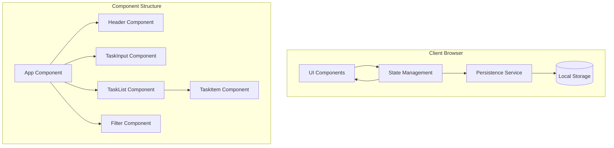

# Design Document

## Overview

This design implements a client-side single-page application (SPA) using React and TypeScript, with local storage for data persistence. The architecture follows a component-based approach with clear separation between UI components, state management, and data persistence layers. The solution prioritizes simplicity, performance, and user experience while meeting all requirements for task management, status tracking, filtering, and responsive design.

## Architecture

### High-Level Architecture



### Component Flow

1. User interacts with UI components (TaskInput, TaskItem, Filter)
2. UI components dispatch actions to state management
3. State management updates application state
4. State changes trigger persistence service to save to local storage
5. UI components re-render based on updated state
6. On app load, persistence service retrieves data from local storage
7. Retrieved data initializes state management
8. UI components render based on initial state

## Components and Interfaces

### 1. App Component

**File**: `src/App.tsx`

- **Purpose**: Root component that orchestrates the application
- **Responsibilities**:
  - Initialize application state
  - Manage global state and task operations
  - Render child components
  - Handle filter state
- **Interfaces**:
  - Props: None
  - State: tasks[], filter, loading

### 2. Header Component

**File**: `src/components/Header.tsx`

- **Purpose**: Display application title and task statistics
- **Responsibilities**:
  - Show application branding
  - Display total tasks and completed count
- **Interfaces**:
  - Props: `{ totalTasks: number, completedTasks: number }`

### 3. TaskInput Component

**File**: `src/components/TaskInput.tsx`

- **Purpose**: Handle new task creation
- **Responsibilities**:
  - Render input field and add button
  - Validate input (non-empty)
  - Call onAddTask callback
  - Clear input after successful addition
- **Interfaces**:
  - Props: `{ onAddTask: (description: string) => void }`

### 4. TaskList Component

**File**: `src/components/TaskList.tsx`

- **Purpose**: Display filtered list of tasks
- **Responsibilities**:
  - Render TaskItem components
  - Apply current filter
  - Show empty state when no tasks match
- **Interfaces**:
  - Props: `{ tasks: Task[], filter: FilterType, onToggle: (id: string) => void, onEdit: (id: string, description: string) => void, onDelete: (id: string) => void }`

### 5. TaskItem Component

**File**: `src/components/TaskItem.tsx`

- **Purpose**: Display individual task with actions
- **Responsibilities**:
  - Show task description and status
  - Handle edit mode toggle
  - Trigger status toggle, edit, and delete actions
  - Apply visual styling for completed state
- **Interfaces**:
  - Props: `{ task: Task, onToggle: () => void, onEdit: (description: string) => void, onDelete: () => void }`

### 6. Filter Component

**File**: `src/components/Filter.tsx`

- **Purpose**: Control task filtering
- **Responsibilities**:
  - Render filter buttons (All, Active, Completed)
  - Highlight active filter
  - Call onFilterChange callback
- **Interfaces**:
  - Props: `{ currentFilter: FilterType, onFilterChange: (filter: FilterType) => void, taskCounts: { all: number, active: number, completed: number } }`

### 7. Persistence Service

**File**: `src/services/persistence.ts`

- **Purpose**: Handle data persistence with local storage
- **Responsibilities**:
  - Save tasks to local storage
  - Load tasks from local storage
  - Handle storage errors
  - Provide fallback for storage unavailability
- **Interfaces**:
  - `saveTasks(tasks: Task[]): boolean`
  - `loadTasks(): Task[]`
  - `isStorageAvailable(): boolean`

## Data Models

### Task Model

```typescript
interface Task {
  id: string;
  description: string;
  completed: boolean;
  createdAt: Date;
  updatedAt: Date;
}
```

### Filter Type

```typescript
type FilterType = "all" | "active" | "completed";
```

### App State

```typescript
interface AppState {
  tasks: Task[];
  filter: FilterType;
  loading: boolean;
  error: string | null;
}
```

## API Specifications

### Task Operations

Since this is a client-side application, these are internal function interfaces:

### Create Task

- **Function**: `createTask(description: string): Task`
- **Input**: Task description string
- **Output**: New Task object with generated ID and timestamps
- **Validation**: Description must be non-empty string

### Update Task

- **Function**: `updateTask(id: string, updates: Partial<Task>): Task`
- **Input**: Task ID and partial task object
- **Output**: Updated task object
- **Errors**: Task not found

### Delete Task

- **Function**: `deleteTask(id: string): void`
- **Input**: Task ID
- **Output**: None
- **Errors**: Task not found

### Toggle Task Status

- **Function**: `toggleTaskStatus(id: string): Task`
- **Input**: Task ID
- **Output**: Updated task with toggled status
- **Errors**: Task not found

## Technology Stack

### Runtime and Languages

- **Primary Language**: TypeScript 5.x
- **Runtime**: Modern web browsers (Chrome 90+, Firefox 88+, Safari 14+)
- **Package Manager**: npm or yarn

### Key Dependencies

- **UI Framework**: React 18.x - Component-based UI library
- **Styling**: CSS Modules or styled-components - Scoped styling solution
- **Build Tool**: Vite - Fast development and build tool
- **Type Checking**: TypeScript - Static type safety
- **Unique ID Generation**: uuid or nanoid - Generate unique task IDs

### Development Tools

- **Linting**: ESLint with React and TypeScript plugins
- **Testing**: Jest + React Testing Library
- **Formatting**: Prettier
- **Pre-commit**: Husky + lint-staged

## Error Handling

### Storage Errors

- **Scenarios**: Local storage unavailable, quota exceeded, permission denied
- **Detection**: Try-catch blocks around storage operations
- **Response**: Show warning banner, continue with in-memory storage
- **Recovery**: Retry storage operations, provide export option

### Validation Errors

- **Scenarios**: Empty task description, invalid task ID
- **Detection**: Input validation before operations
- **Response**: Show inline error messages
- **Recovery**: Keep form state, highlight error field

### Runtime Errors

- **Scenarios**: Component errors, state corruption
- **Detection**: Error boundaries in React
- **Response**: Show fallback UI with error message
- **Recovery**: Provide refresh button, maintain partial functionality

## Security Considerations

### Authentication and Authorization

Not required for this local-only application. All data is stored client-side.

### Data Protection

- Input sanitization to prevent XSS attacks
- Content Security Policy headers in production
- No sensitive data stored (only task descriptions)

### API Security

Not applicable - no external API calls.

## Testing Strategy

### Unit Tests

- Test all utility functions (task operations, filtering)
- Test persistence service with mocked local storage
- Test component logic in isolation
- Target 80% code coverage

### Integration Tests

- Test component interactions (add, edit, delete flows)
- Test filter functionality with various task states
- Test persistence across page reloads

### End-to-End Tests

- Test complete user workflows
- Test responsive behavior on different viewports
- Test keyboard navigation and accessibility

## Configuration

### Environment Variables

```
VITE_APP_TITLE=Simple ToDo App
VITE_STORAGE_KEY=todo-app-tasks
VITE_MAX_TASKS=1000
```

### Configuration Files

- `tsconfig.json` - TypeScript configuration
- `vite.config.ts` - Build configuration
- `.eslintrc.json` - Linting rules
- `package.json` - Dependencies and scripts

## Deployment and Operations

### Deployment Architecture

Static site deployment to CDN or static hosting service:

- Build outputs to `dist/` directory
- Single `index.html` with bundled JS/CSS
- No server-side requirements

### Monitoring and Logging

- Console logging for development
- Error tracking with service like Sentry (optional)
- Analytics for usage patterns (optional)

### Maintenance

- Regular dependency updates
- Browser compatibility testing
- Performance monitoring
- User feedback collection
